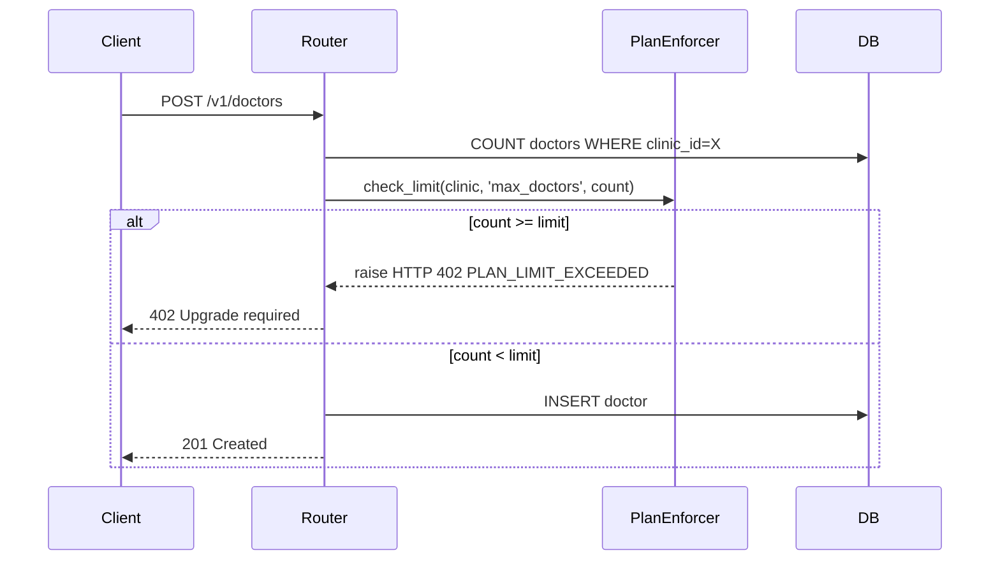
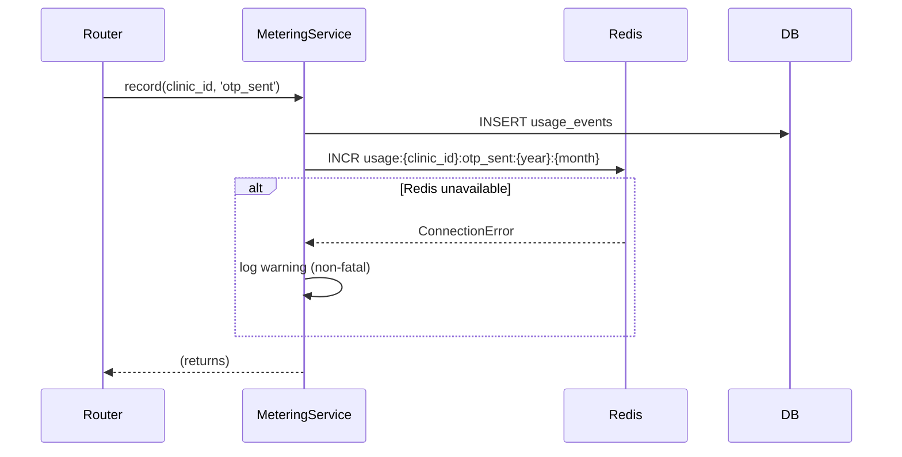

# Design Document — CACMS Phase 1 SaaS Completion

## Overview

This document covers the technical design for the commercial and SaaS layer of CACMS Phase 1. The existing codebase already has multi-tenant data isolation, JWT authentication, role-based access control, and AWS infrastructure. This phase adds the monetisation layer on top: plan tiers with enforcement, usage metering, Razorpay subscription billing, MSG91 SMS OTP delivery, a super-admin management API, Flutter settings and billing screens, and Nginx/HTTPS infrastructure.

The design follows the existing patterns in the codebase: async SQLAlchemy 2.x with PostgreSQL, FastAPI dependency injection, Pydantic settings, and the `require_roles` middleware pattern.

### Key Design Decisions

- **Plan enforcement is synchronous and in-process** — `PlanEnforcer` is a stateless service that reads `PLAN_FEATURES` and the clinic's current plan. No external calls, no caching needed.
- **Metering is fire-and-forget with Redis acceleration** — `MeteringService.record` writes to both Redis (for fast reads) and PostgreSQL (for durability). Redis failure is non-fatal.
- **Webhook processing is synchronous** — Razorpay webhooks are verified and processed inline. No queue needed at Phase 1 scale.
- **SUPERADMIN_TOKEN is completely separate from JWT** — a dedicated FastAPI dependency reads the `Authorization: Bearer <token>` header and compares it to the env var. No JWT decode path is involved.
- **SMS fallback is dev-friendly** — when `MSG91_AUTH_KEY` is empty, OTPs are logged at INFO level. This preserves the existing dev workflow without code changes.

---

## Architecture

```mermaid
graph TD
    subgraph Flutter App
        AS[AdminShell]
        CSS[ClinicSettingsScreen]
        BS[BillingScreen]
        AS --> CSS
        AS --> BS
    end

    subgraph FastAPI Backend
        AR[auth router]
        CR[clinic router]
        SAR[superadmin router]
        BR[billing router]
        PE[PlanEnforcer]
        MS[MeteringService]
        BLS[BillingService]
        SMS[SmsService]
        AR --> SMS
        AR --> MS
        CR --> PE
        CR --> MS
        BR --> BLS
    end

    subgraph Data Layer
        PG[(PostgreSQL)]
        RD[(Redis)]
        MS --> PG
        MS --> RD
        BLS --> PG
    end

    subgraph External
        RZP[Razorpay API]
        M91[MSG91 API]
        BLS --> RZP
        SMS --> M91
    end

    Flutter App -->|HTTPS| FastAPI Backend
    RZP -->|Webhook| BR
```

### Request Flow — Plan Enforcement



### Request Flow — Metering



---

## Components and Interfaces

### cacms/config/plans.py

A pure Python module containing the `PLAN_FEATURES` dict. No imports from the rest of the app — this is the single source of truth for plan limits.

```python
PLAN_TIERS = ["free", "starter", "clinic", "pro", "enterprise"]

PLAN_FEATURES: dict[str, dict] = {
    "free":       { ... },
    "starter":    { ... },
    "clinic":     { ... },
    "pro":        { ... },
    "enterprise": { ... },
}
```

Keys in each plan dict: `max_doctors`, `max_staff`, `max_appointments_per_month`, `max_otps_per_month`, `can_export_reports`, `can_export_pdf`, `whatsapp_reminders`, `multi_branch`, `api_access`, `lab_integrations`.

`None` for a numeric key means unlimited. Boolean keys default to `False` for lower tiers.

### cacms/services/plan_enforcer.py

Stateless service class. All methods are synchronous (no I/O).

```python
class PlanEnforcer:
    def check_feature(self, clinic: Clinic, feature_name: str) -> None:
        """Raises HTTP 402 if the clinic's plan does not include the feature."""

    def check_limit(self, clinic: Clinic, resource_name: str, current_count: int) -> None:
        """Raises HTTP 402 if current_count >= plan limit. No-op if limit is None."""

    def get_plan_features(self, clinic: Clinic) -> dict:
        """Returns the PLAN_FEATURES entry for the clinic's plan."""
```

Error response shape (consistent with existing error handlers):
```json
{
  "error_code": "PLAN_LIMIT_EXCEEDED",
  "message": "Your free plan allows up to 1 doctor. Upgrade to add more.",
  "detail": { "resource": "max_doctors", "limit": 1, "current": 1 }
}
```

### cacms/models/usage_event.py

```python
class UsageEvent(Base):
    __tablename__ = "usage_events"

    id: Mapped[uuid.UUID]          # PK, gen_random_uuid()
    clinic_id: Mapped[uuid.UUID]   # FK → clinics.clinic_id
    event_type: Mapped[str]        # 'otp_sent' | 'appointment_created' | 'report_export'
    quantity: Mapped[int]          # default 1
    metadata: Mapped[Optional[dict]]  # JSONB, nullable
    billed: Mapped[bool]           # default false
    created_at: Mapped[datetime]   # TIMESTAMPTZ, default now()
```

### cacms/services/metering_service.py

```python
class MeteringService:
    def __init__(self, redis_client=None):
        self._redis = redis_client  # Optional; obtained from app.state

    async def record(
        self,
        db: AsyncSession,
        clinic_id: uuid.UUID,
        event_type: str,
        quantity: int = 1,
        metadata: dict | None = None,
    ) -> None:
        """Persist UsageEvent to DB; increment Redis counter if available."""

    async def get_monthly_usage(
        self,
        db: AsyncSession,
        clinic_id: uuid.UUID,
        year: int,
        month: int,
    ) -> dict[str, int]:
        """Return {event_type: count} for the given month. Redis-first, DB fallback."""
```

Redis key format: `usage:{clinic_id}:{event_type}:{year}:{month}`
Redis TTL: 90 days (7_776_000 seconds)

The `MeteringService` instance is created once at startup and stored on `app.state.metering`. Routers obtain it via a FastAPI dependency:

```python
async def get_metering(request: Request) -> MeteringService:
    return request.app.state.metering
```

### cacms/routers/clinic.py

All endpoints require `require_owner` dependency.

| Method | Path | Description |
|--------|------|-------------|
| GET | `/v1/clinic` | Returns `clinic_id`, `name`, `plan`, `plan_status`, `billing_email` |
| PATCH | `/v1/clinic` | Updates `name` and/or `billing_email`; validates non-empty name |
| GET | `/v1/clinic/usage` | Returns current month's `{event_type: count}` dict |
| GET | `/v1/clinic/plan` | Returns plan name, status, full feature limits, and current usage |

### cacms/routers/superadmin.py

Authentication via a dedicated dependency:

```python
async def require_superadmin(
    credentials: HTTPAuthorizationCredentials = Depends(bearer_scheme),
) -> None:
    if not credentials or credentials.credentials != settings.SUPERADMIN_TOKEN:
        raise HTTPException(status_code=401, detail={"error_code": "UNAUTHORIZED", ...})
```

This dependency is completely independent of `get_current_user` — no JWT decode occurs.

| Method | Path | Description |
|--------|------|-------------|
| GET | `/v1/superadmin/clinics` | Paginated list: `clinic_id`, `name`, `plan`, `plan_status`, `created_at` |
| PATCH | `/v1/superadmin/clinics/{clinic_id}/plan` | Update clinic plan; 404 if not found |
| GET | `/v1/superadmin/stats` | `total_clinics`, `total_appointments_today`, `mrr_estimate` |

MRR estimate calculation: sum of per-plan monthly prices for all clinics with `plan_status = 'active'` and `plan != 'free'`. Plan prices are defined as a constant in `plans.py`.

### cacms/routers/billing.py

| Method | Path | Auth | Description |
|--------|------|------|-------------|
| GET | `/v1/billing/plans` | None | List all plans with prices and features |
| POST | `/v1/billing/subscribe` | owner | Create Razorpay subscription; return sub ID + payment link |
| GET | `/v1/billing/status` | owner | Return `plan`, `plan_status`, `razorpay_subscription_id` |
| POST | `/v1/billing/webhook` | None (signature-verified) | Process Razorpay events |

### cacms/services/billing_service.py

```python
class BillingService:
    async def create_subscription(
        self, db: AsyncSession, clinic: Clinic, plan_name: str
    ) -> dict:
        """Create Razorpay subscription; persist sub ID to clinic record."""

    async def cancel_subscription(
        self, db: AsyncSession, clinic: Clinic
    ) -> None:
        """Cancel active Razorpay subscription."""

    async def get_subscription_status(
        self, db: AsyncSession, clinic: Clinic
    ) -> dict:
        """Fetch subscription status from Razorpay."""
```

Razorpay plan IDs are mapped from CACMS plan names via a constant dict in `billing_service.py`. The Razorpay client is initialised once using `RAZORPAY_KEY_ID` and `RAZORPAY_KEY_SECRET`.

### cacms/services/sms_service.py

```python
class SmsService:
    async def send_otp_sms(self, phone: str, otp: str) -> None:
        """Send OTP via MSG91 if AUTH_KEY is set; otherwise log at INFO."""
```

MSG91 API endpoint: `https://api.msg91.com/api/v5/otp`

When `MSG91_AUTH_KEY` is empty, the method logs `[SMS DEV] Phone: {phone}  OTP: {otp}` at INFO level and returns without making any HTTP call.

### Flutter — ClinicSettingsScreen

Located at `cacms_flutter/lib/features/admin/settings/clinic_settings_screen.dart`.

State management: `StatefulWidget` with `FutureBuilder` for initial load. Uses existing `ApiClient` (Dio-based).

On load: parallel calls to `GET /v1/clinic` and `GET /v1/clinic/plan`. Displays:
- Clinic name (editable)
- Billing email (editable)
- Plan name and status badge
- Usage table: three rows (`otp_sent`, `appointment_created`, `report_export`) with current count vs. plan limit
- "Upgrade Plan" button → navigates to `BillingScreen`

On save: `PATCH /v1/clinic` with changed fields; shows `SnackBar` on success; re-fetches data.

### Flutter — BillingScreen

Located at `cacms_flutter/lib/features/admin/billing/billing_screen.dart`.

On load: parallel calls to `GET /v1/billing/plans` and `GET /v1/billing/status`. Renders a scrollable list of plan cards. Current plan card is highlighted with a border/badge. Each card shows name, price (formatted as ₹X/month), and key feature bullets.

Subscribe flow: tap "Subscribe" → `POST /v1/billing/subscribe` → open returned URL in browser via `url_launcher`. Handle 409 with an inline message.

### Flutter — AdminShell Changes

The `AdminShell` reads the user's role from the JWT stored in `flutter_secure_storage`. The role is decoded from the JWT payload (no extra API call needed — the token already contains `role`).

Two new tabs are added conditionally:

```dart
if (role == 'owner') ...[
  _TabDef(icon: Icons.settings_outlined, label: 'Settings'),
  _TabDef(icon: Icons.payment_outlined, label: 'Billing'),
]
```

The `IndexedStack` children list is built dynamically to match the tab list.

### Nginx Configuration

File: `nginx/cacms.conf`

```nginx
upstream cacms_api {
    server 127.0.0.1:8000;
}

server {
    listen 80;
    server_name _;
    return 301 https://$host$request_uri;
}

server {
    listen 443 ssl;
    server_name _;

    ssl_certificate     /etc/letsencrypt/live/<domain>/fullchain.pem;
    ssl_certificate_key /etc/letsencrypt/live/<domain>/privkey.pem;

    location / {
        proxy_pass http://cacms_api;
        proxy_set_header Host $host;
        proxy_set_header X-Real-IP $remote_addr;
        proxy_set_header X-Forwarded-For $proxy_add_x_forwarded_for;
        proxy_set_header X-Forwarded-Proto $scheme;
    }

    location /v1/events/ {
        proxy_pass http://cacms_api;
        proxy_buffering off;
        proxy_cache off;
        proxy_set_header Connection '';
        proxy_http_version 1.1;
        chunked_transfer_encoding on;
    }
}
```

---

## Data Models

### Migration 0005 — clinics table additions

```sql
ALTER TABLE clinics
    ADD COLUMN plan TEXT NOT NULL DEFAULT 'free',
    ADD COLUMN plan_status TEXT NOT NULL DEFAULT 'active',
    ADD COLUMN billing_email TEXT,
    ADD COLUMN max_doctors INTEGER,
    ADD COLUMN max_staff INTEGER,
    ADD COLUMN razorpay_subscription_id TEXT;
```

A `CHECK` constraint enforces valid plan values:
```sql
ALTER TABLE clinics
    ADD CONSTRAINT ck_clinics_plan
    CHECK (plan IN ('free', 'starter', 'clinic', 'pro', 'enterprise'));
```

### Migration 0005 — usage_events table

```sql
CREATE TABLE usage_events (
    id UUID PRIMARY KEY DEFAULT gen_random_uuid(),
    clinic_id UUID NOT NULL REFERENCES clinics(clinic_id) ON DELETE CASCADE,
    event_type TEXT NOT NULL,
    quantity INTEGER NOT NULL DEFAULT 1,
    metadata JSONB,
    billed BOOLEAN NOT NULL DEFAULT false,
    created_at TIMESTAMPTZ NOT NULL DEFAULT now()
);

CREATE INDEX idx_usage_events_clinic_month
    ON usage_events (clinic_id, event_type, created_at);
```

### Updated Clinic ORM Model

```python
class Clinic(Base):
    __tablename__ = "clinics"
    __table_args__ = (
        CheckConstraint(
            "plan IN ('free','starter','clinic','pro','enterprise')",
            name="ck_clinics_plan",
        ),
    )

    clinic_id: Mapped[uuid.UUID]
    name: Mapped[str]
    plan: Mapped[str]                              # default 'free'
    plan_status: Mapped[str]                       # default 'active'
    billing_email: Mapped[Optional[str]]
    max_doctors: Mapped[Optional[int]]
    max_staff: Mapped[Optional[int]]
    razorpay_subscription_id: Mapped[Optional[str]]
    created_at: Mapped[datetime]
```

### Settings additions (cacms/config.py)

```python
# Super-admin
SUPERADMIN_TOKEN: str = ""

# MSG91
MSG91_AUTH_KEY: str = ""
MSG91_SENDER_ID: str = "CACMS"
MSG91_OTP_TEMPLATE_ID: str = ""

# Razorpay
RAZORPAY_KEY_ID: str = ""
RAZORPAY_KEY_SECRET: str = ""
RAZORPAY_WEBHOOK_SECRET: str = ""
```

A `model_validator` raises a startup error when `ENVIRONMENT == 'production'` and `SUPERADMIN_TOKEN` is empty, following the same pattern as the existing `JWT_SECRET` validator.

### main.py changes

```python
app = FastAPI(
    title="CACMS API",
    version="1.0.0",
    docs_url=None if settings.ENVIRONMENT == "production" else "/docs",
    redoc_url=None if settings.ENVIRONMENT == "production" else "/redoc",
)
```

Router registration additions:
```python
from cacms.routers import clinic, superadmin, billing
app.include_router(clinic.router, prefix="/v1")
app.include_router(superadmin.router, prefix="/v1")
app.include_router(billing.router, prefix="/v1")
```

On startup, initialise `MeteringService` and attach to `app.state`:
```python
@app.on_event("startup")
async def startup():
    redis_client = None
    if settings.REDIS_URL:
        import redis.asyncio as aioredis
        redis_client = aioredis.from_url(settings.REDIS_URL)
    app.state.metering = MeteringService(redis_client=redis_client)
```

---

## Correctness Properties

*A property is a characteristic or behavior that should hold true across all valid executions of a system — essentially, a formal statement about what the system should do. Properties serve as the bridge between human-readable specifications and machine-verifiable correctness guarantees.*

Property-based testing is applicable here because the core logic — plan enforcement, metering aggregation, webhook signature verification, and input validation — consists of pure or near-pure functions whose correctness must hold across a wide input space. The testing library used is **Hypothesis** (Python), which is already present in the project (`.hypothesis/` directory exists).

### Property 1: New clinic registration always defaults to free/active plan

*For any* valid clinic registration payload (any clinic name, any owner username/password), the resulting clinic record SHALL have `plan = 'free'` and `plan_status = 'active'`.

**Validates: Requirements 1.3**

---

### Property 2: Plan name validation rejects all non-canonical values

*For any* string that is not one of `{'free', 'starter', 'clinic', 'pro', 'enterprise'}`, attempting to store or validate it as a plan name SHALL be rejected with a validation error.

**Validates: Requirements 1.4**

---

### Property 3: PLAN_FEATURES completeness — every plan has all required keys

*For any* plan name in `PLAN_FEATURES`, the plan's feature dict SHALL contain all ten required keys: `max_doctors`, `max_staff`, `max_appointments_per_month`, `max_otps_per_month`, `can_export_reports`, `can_export_pdf`, `whatsapp_reminders`, `multi_branch`, `api_access`, `lab_integrations`.

**Validates: Requirements 2.2**

---

### Property 4: Plan tier ordering — higher tiers have non-decreasing numeric limits

*For any* two plans where one is higher in the tier ordering (`free < starter < clinic < pro < enterprise`), the higher plan's numeric limits SHALL be greater than or equal to the lower plan's limits, where `None` (unlimited) is treated as greater than any finite value.

**Validates: Requirements 2.4**

---

### Property 5: PlanEnforcer rejects features not in plan

*For any* clinic with a given plan, and *for any* feature name that is `False` in that plan's feature dict, calling `PlanEnforcer.check_feature(clinic, feature_name)` SHALL raise an `HTTPException` with status code 402 and `error_code = 'PLAN_LIMIT_EXCEEDED'`.

**Validates: Requirements 3.2**

---

### Property 6: PlanEnforcer rejects counts at or above finite limits

*For any* clinic with a given plan, and *for any* resource with a finite (non-`None`) limit `L`, calling `PlanEnforcer.check_limit(clinic, resource, count)` with `count >= L` SHALL raise an `HTTPException` with status code 402. Calling it with `count < L` SHALL NOT raise.

**Validates: Requirements 3.3**

---

### Property 7: PlanEnforcer allows all counts when limit is None

*For any* clinic whose plan has `None` for a given resource limit, calling `PlanEnforcer.check_limit(clinic, resource, count)` with *any* non-negative integer `count` SHALL NOT raise an exception.

**Validates: Requirements 3.4**

---

### Property 8: Metering record-then-read round trip

*For any* clinic ID, event type, and positive quantity, calling `MeteringService.record(...)` followed by `MeteringService.get_monthly_usage(...)` for the same clinic and current month SHALL return a count for that event type that is at least the recorded quantity.

**Validates: Requirements 4.4, 4.6**

---

### Property 9: Clinic PATCH name round trip

*For any* non-empty, non-whitespace clinic name string, calling `PATCH /v1/clinic` with that name followed by `GET /v1/clinic` SHALL return the same name in the response.

**Validates: Requirements 5.2**

---

### Property 10: Clinic PATCH rejects whitespace-only names

*For any* string composed entirely of whitespace characters (spaces, tabs, newlines), calling `PATCH /v1/clinic` with that string as `name` SHALL return HTTP 422.

**Validates: Requirements 5.3**

---

### Property 11: Superadmin token auth — wrong token always returns 401

*For any* superadmin endpoint and *for any* Bearer token value that is not equal to `settings.SUPERADMIN_TOKEN`, the request SHALL return HTTP 401. A request with the correct token SHALL not return 401.

**Validates: Requirements 6.1, 6.2**

---

### Property 12: Webhook signature verification — invalid signature always rejected

*For any* Razorpay webhook payload body and *for any* `X-Razorpay-Signature` header value that does not match the HMAC-SHA256 of the body using `RAZORPAY_WEBHOOK_SECRET`, the `POST /v1/billing/webhook` endpoint SHALL return HTTP 400 and SHALL NOT update any clinic record.

**Validates: Requirements 7.7, 7.11**

---

### Property 13: Webhook subscription.charged updates plan status

*For any* valid `subscription.charged` webhook payload with a correct signature, the clinic associated with the subscription SHALL have its `plan_status` set to `'active'` after processing.

**Validates: Requirements 7.8**

---

### Property 14: Webhook subscription.halted sets grace status

*For any* valid `subscription.halted` webhook payload with a correct signature, the clinic associated with the subscription SHALL have its `plan_status` set to `'grace'` after processing.

**Validates: Requirements 7.9**

---

### Property 15: SMS dev-mode fallback — no MSG91 call when key is absent

*For any* valid OTP request (any phone number with an existing patient), when `MSG91_AUTH_KEY` is empty, the `POST /v1/auth/request-otp` endpoint SHALL return `{"message": "OTP sent"}` and SHALL NOT make any HTTP call to the MSG91 API.

**Validates: Requirements 8.4**

---

### Property 16: Docs disabled in production for any environment value

*For any* application instance initialised with `ENVIRONMENT = 'production'`, the FastAPI app's `docs_url` and `redoc_url` SHALL both be `None`.

**Validates: Requirements 12.1**

---

## Error Handling

### HTTP 402 — Plan Limit Exceeded

Raised by `PlanEnforcer`. Response body:
```json
{
  "error_code": "PLAN_LIMIT_EXCEEDED",
  "message": "Your free plan allows up to 1 doctor. Upgrade to add more.",
  "detail": {
    "resource": "max_doctors",
    "limit": 1,
    "current": 1,
    "upgrade_url": "/v1/billing/plans"
  }
}
```

This error code must be added to the existing `exception_handlers.py` pattern.

### HTTP 409 — Already Subscribed

Raised by `POST /v1/billing/subscribe` when the clinic is already on the requested plan:
```json
{
  "error_code": "ALREADY_SUBSCRIBED",
  "message": "Your clinic is already on the clinic plan."
}
```

### HTTP 502 — SMS Delivery Failed

Raised when MSG91 returns an error or the HTTP call fails:
```json
{
  "error_code": "SMS_DELIVERY_FAILED",
  "message": "Failed to deliver OTP via SMS. Please try again."
}
```

### HTTP 400 — Webhook Signature Invalid

Raised by `POST /v1/billing/webhook` when signature verification fails:
```json
{
  "error_code": "INVALID_SIGNATURE",
  "message": "Webhook signature verification failed."
}
```

### Redis Unavailability

`MeteringService.record` catches `redis.exceptions.RedisError` (and `ConnectionError`), logs a warning with the clinic ID and event type, and continues. The DB write is not rolled back. This ensures metering never blocks the primary request path.

### Razorpay API Errors

`BillingService` wraps Razorpay SDK calls in try/except. On failure, it raises HTTP 502 with `error_code = 'PAYMENT_GATEWAY_ERROR'` and logs the full error for debugging.

### SUPERADMIN_TOKEN not set in production

The `model_validator` in `Settings` raises `ValueError` at startup if `ENVIRONMENT == 'production'` and `SUPERADMIN_TOKEN == ''`. This prevents silent security misconfiguration.

---

## Testing Strategy

### Unit Tests (pytest + pytest-asyncio)

Focus on specific examples, edge cases, and error conditions:

- `PlanEnforcer`: test each plan/feature combination with concrete examples; test boundary values for limits (count = limit - 1, count = limit, count = limit + 1)
- `MeteringService`: test Redis-available path, Redis-unavailable path (mock Redis to raise), DB fallback path
- `SmsService`: test MSG91_AUTH_KEY set (mock httpx), MSG91_AUTH_KEY empty (verify no HTTP call, verify log)
- `BillingService`: mock Razorpay SDK; test create/cancel/status flows; test already-subscribed 409
- Webhook handler: test valid signature + each event type; test invalid signature → 400
- Superadmin auth: test correct token → 200; test wrong token → 401; test missing token → 401
- `PATCH /v1/clinic`: test empty name → 422; test whitespace-only name → 422; test valid update → 200

### Property-Based Tests (Hypothesis)

Each property test runs a minimum of 100 iterations. Tests are tagged with a comment referencing the design property.

```python
# Feature: cacms-phase1-saas-completion, Property 1: New clinic registration always defaults to free/active plan
@given(st.text(min_size=1), st.text(min_size=1), st.text(min_size=8))
@settings(max_examples=100)
async def test_clinic_registration_defaults(clinic_name, username, password):
    ...
```

Properties to implement as Hypothesis tests:
- **Property 1**: `@given` clinic name + owner credentials → verify `plan='free'`, `plan_status='active'`
- **Property 2**: `@given` arbitrary strings → verify only the 5 valid plan names pass validation
- **Property 3**: iterate all plans in `PLAN_FEATURES` → verify all 10 keys present (deterministic, but structured as a property)
- **Property 4**: `@given` two plan names from the tier list → verify numeric limit ordering
- **Property 5**: `@given` plan name + feature name not in plan → verify `check_feature` raises 402
- **Property 6**: `@given` plan name + resource with finite limit + count ≥ limit → verify `check_limit` raises 402
- **Property 7**: `@given` plan name with `None` limit + any non-negative count → verify `check_limit` does not raise
- **Property 8**: `@given` clinic ID + event type + quantity → record then read → verify count ≥ quantity
- **Property 9**: `@given` non-empty non-whitespace name → PATCH then GET → verify name matches
- **Property 10**: `@given` whitespace-only strings → PATCH → verify 422
- **Property 11**: `@given` arbitrary token strings ≠ SUPERADMIN_TOKEN → verify 401
- **Property 12**: `@given` arbitrary payload + arbitrary signature → verify 400 when signature invalid
- **Property 13**: `@given` valid subscription.charged payload → verify `plan_status='active'`
- **Property 14**: `@given` valid subscription.halted payload → verify `plan_status='grace'`
- **Property 15**: `@given` valid phone number → verify no HTTP call when MSG91_AUTH_KEY empty
- **Property 16**: verify `docs_url=None` and `redoc_url=None` when `ENVIRONMENT='production'`

### Integration Tests

Run against a real test database (PostgreSQL in Docker):

- Doctor creation blocked at plan limit (Requirement 3.5)
- Staff creation blocked at plan limit (Requirement 3.6)
- OTP request records `otp_sent` usage event (Requirement 4.7)
- Appointment creation records `appointment_created` usage event (Requirement 4.8)
- Daily report records `report_export` usage event (Requirement 4.9)
- Superadmin plan update persists to DB and is reflected in `GET /v1/clinic`

### Flutter Widget Tests

- `ClinicSettingsScreen`: mock API responses; verify clinic name, plan, usage table render; verify edit form submits PATCH; verify "Upgrade Plan" navigates to BillingScreen
- `BillingScreen`: mock API responses; verify plan cards render; verify current plan highlighted; verify Subscribe calls POST and opens URL; verify 409 shows inline message
- `AdminShell`: verify Settings and Billing tabs appear when role=owner; verify they do not appear for other roles

### Infrastructure Checks

- Nginx config syntax: `nginx -t`
- Certbot dry-run: `certbot renew --dry-run`
- Port 443 open: verify Terraform security group rule
