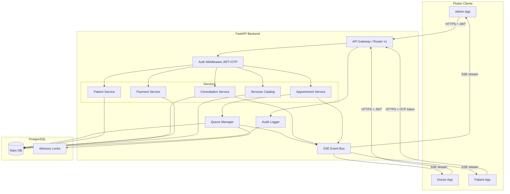

# Design Document: Clinic Appointment & Consultation Management System (CACMS)

## Overview

CACMS is a SaaS backend for high-throughput retail clinics. It exposes a versioned REST API (FastAPI, Python) backed by PostgreSQL, with real-time updates delivered via Server-Sent Events. Three roles — Admin, Doctor, Patient — interact through a Flutter frontend. The system's core invariant is **atomic queue integrity**: every queue number assignment and queue advancement must be serialized at the database level to prevent duplicates or gaps under concurrent load.

Key design goals:
- Sub-500ms patient lookup and appointment creation under concurrent load
- Atomic, race-condition-free queue management using PostgreSQL advisory locks + `SELECT FOR UPDATE SKIP LOCKED`
- Ordered, deduplicated SSE event delivery with reconnection support
- Role-based access control enforced at the API middleware layer
- Full audit trail for every mutating operation

---

## Architecture



### Layer Responsibilities

| Layer | Responsibility |
|---|---|
| Flutter Clients | Role-specific UI, SSE subscription, OTP/JWT auth |
| FastAPI Router | Request routing, versioning (`/v1/`), dependency injection |
| Auth Middleware | JWT validation (Admin/Doctor), OTP token validation (Patient), role extraction |
| Service Layer | Business logic, orchestration, validation |
| Queue Manager | Atomic queue number assignment and Call Next transaction |
| SSE Event Bus | In-process async event fan-out to connected SSE clients |
| Audit Logger | Middleware hook writing audit rows on every mutating request |
| PostgreSQL | Persistence, constraints, indexes, advisory locks |

---

## Components and Interfaces

### Backend Project Structure

```
cacms/
├── main.py                    # FastAPI app factory
├── config.py                  # Settings (env vars)
├── database.py                # SQLAlchemy async engine + session
├── models/
│   ├── patient.py
│   ├── doctor.py
│   ├── appointment.py
│   ├── consultation.py
│   ├── service.py
│   ├── payment.py
│   └── audit_log.py
├── schemas/
│   ├── patient.py
│   ├── appointment.py
│   ├── consultation.py
│   ├── service.py
│   └── payment.py
├── routers/
│   ├── auth.py
│   ├── patients.py
│   ├── appointments.py
│   ├── consultations.py
│   ├── services.py
│   ├── payments.py
│   ├── patient_status.py
│   └── events.py             # SSE endpoints
├── services/
│   ├── queue_manager.py      # Atomic queue logic
│   ├── sse_bus.py            # SSE event bus
│   ├── otp_service.py        # OTP generation + verification
│   └── audit_service.py
├── middleware/
│   ├── auth_middleware.py
│   └── audit_middleware.py
└── tests/
    ├── unit/
    ├── integration/
    └── property/
```

### Flutter Project Structure

```
cacms_flutter/
├── lib/
│   ├── main.dart
│   ├── core/
│   │   ├── auth/             # JWT + OTP token storage
│   │   ├── api/              # HTTP client, SSE client
│   │   ├── theme/            # app_colors.dart, app_typography.dart, app_theme.dart
│   │   ├── widgets/          # StatusChip, VisitTypeBadge, QueueNumberDisplay, SseIndicator, AppToast, EmptyState
│   │   └── models/           # Shared data models
│   ├── features/
│   │   ├── admin/
│   │   │   ├── login/
│   │   │   ├── home/
│   │   │   ├── patient_lookup/
│   │   │   ├── appointment_create/
│   │   │   └── payment/
│   │   ├── doctor/
│   │   │   ├── login/
│   │   │   ├── queue_dashboard/
│   │   │   ├── call_next/
│   │   │   └── consultation/
│   │   └── patient/
│   │       ├── otp_login/
│   │       └── live_status/
```

### API Endpoint Surface

All endpoints are prefixed `/v1/`.

| Method | Path | Role | Description |
|---|---|---|---|
| POST | `/auth/login` | Admin, Doctor | JWT login |
| POST | `/auth/verify-otp` | Patient | OTP request + verify |
| POST | `/patients` | Admin | Register patient |
| GET | `/patients?phone=` | Admin | Lookup by phone |
| POST | `/appointments` | Admin | Create appointment |
| GET | `/appointments/today` | Doctor, Admin | Daily queue |
| GET | `/appointments/{id}` | Doctor, Admin | Single appointment |
| PATCH | `/appointments/{id}/status` | Admin, Doctor | no-show / cancelled |
| PATCH | `/appointments/{id}/clinical` | Doctor | Call Next (advance queue) |
| PATCH | `/appointments/{id}/schedule` | Admin, Doctor | Reschedule |
| POST | `/consultations` | Doctor | Create consultation |
| GET | `/consultations/{appointment_id}` | Doctor, Admin | Get consultation |
| GET | `/services` | Admin, Doctor | Rate list |
| POST | `/payments` | Admin | Record payment |
| POST | `/patient/appointment-status` | Patient | Current status |
| GET | `/events/doctor/{doctor_id}` | Doctor, Admin | SSE stream |
| GET | `/events/patient/{patient_id}` | Patient | SSE stream |

### SSE Event Bus Interface

```python
class SSEBus:
    async def publish(self, channel: str, event_type: str, data: dict, event_id: str) -> None: ...
    async def subscribe(self, channel: str) -> AsyncGenerator[SSEEvent, None]: ...
    async def unsubscribe(self, channel: str, subscriber_id: str) -> None: ...
```

Channels follow the pattern `doctor:{doctor_id}` and `patient:{patient_id}`.

### Queue Manager Interface

```python
class QueueManager:
    async def assign_queue_number(
        self, db: AsyncSession, doctor_id: UUID, scheduled_date: date, visit_type: str
    ) -> int: ...

    async def call_next(
        self, db: AsyncSession, doctor_id: UUID, scheduled_date: date
    ) -> CallNextResult: ...
```

---

## Data Models

### PostgreSQL DDL

```sql
-- Enable UUID generation
CREATE EXTENSION IF NOT EXISTS "pgcrypto";

-- Doctors (managed externally or seeded; minimal schema shown)
CREATE TABLE doctors (
    doctor_id       UUID PRIMARY KEY DEFAULT gen_random_uuid(),
    name            TEXT NOT NULL,
    specialization  TEXT,
    active          BOOLEAN NOT NULL DEFAULT true,
    max_patients_per_day INT NOT NULL DEFAULT 40,
    created_at      TIMESTAMPTZ NOT NULL DEFAULT now()
);

-- Patients
CREATE TABLE patients (
    patient_id      UUID PRIMARY KEY DEFAULT gen_random_uuid(),
    name            TEXT NOT NULL,
    phone           TEXT NOT NULL,
    age             INT,
    gender          TEXT CHECK (gender IN ('male', 'female', 'other')),
    address         TEXT,
    consent_given   BOOLEAN NOT NULL DEFAULT false,
    consent_date    TIMESTAMPTZ,
    created_at      TIMESTAMPTZ NOT NULL DEFAULT now(),
    CONSTRAINT uq_patients_phone UNIQUE (phone)
);
CREATE INDEX idx_patients_phone ON patients (phone);

-- Appointments
CREATE TYPE appointment_status AS ENUM (
    'scheduled', 'in-progress', 'completed', 'cancelled', 'no-show'
);
CREATE TYPE visit_type AS ENUM ('normal', 'follow-up', 'emergency');

CREATE TABLE appointments (
    appointment_id  UUID PRIMARY KEY DEFAULT gen_random_uuid(),
    patient_id      UUID NOT NULL REFERENCES patients(patient_id),
    doctor_id       UUID NOT NULL REFERENCES doctors(doctor_id),
    scheduled_date  DATE NOT NULL,
    queue_number    INT NOT NULL,
    visit_type      visit_type NOT NULL DEFAULT 'normal',
    status          appointment_status NOT NULL DEFAULT 'scheduled',
    created_at      TIMESTAMPTZ NOT NULL DEFAULT now(),
    updated_at      TIMESTAMPTZ NOT NULL DEFAULT now(),
    CONSTRAINT uq_appointments_queue UNIQUE (doctor_id, scheduled_date, queue_number)
);
CREATE INDEX idx_appointments_doctor_date ON appointments (doctor_id, scheduled_date);
CREATE INDEX idx_appointments_patient     ON appointments (patient_id);

-- Partial unique index: at most one in-progress appointment per doctor per day
CREATE UNIQUE INDEX uq_one_inprogress_per_doctor_date
    ON appointments (doctor_id, scheduled_date)
    WHERE status = 'in-progress';

-- Consultations
CREATE TABLE consultations (
    consultation_id UUID PRIMARY KEY DEFAULT gen_random_uuid(),
    appointment_id  UUID NOT NULL REFERENCES appointments(appointment_id),
    symptoms        TEXT NOT NULL,
    diagnosis       TEXT NOT NULL,
    notes           TEXT,
    next_visit_date DATE,
    created_at      TIMESTAMPTZ NOT NULL DEFAULT now(),
    updated_at      TIMESTAMPTZ NOT NULL DEFAULT now(),
    CONSTRAINT uq_consultations_appointment UNIQUE (appointment_id)
);

-- Services catalog
CREATE TYPE service_category AS ENUM ('consultation', 'test', 'procedure');

CREATE TABLE services (
    service_id  UUID PRIMARY KEY DEFAULT gen_random_uuid(),
    name        TEXT NOT NULL,
    category    service_category NOT NULL,
    base_price  NUMERIC(10,2) NOT NULL,
    active      BOOLEAN NOT NULL DEFAULT true,
    created_at  TIMESTAMPTZ NOT NULL DEFAULT now()
);

-- Consultation ↔ Services (line items)
CREATE TABLE consultation_services (
    id              UUID PRIMARY KEY DEFAULT gen_random_uuid(),
    consultation_id UUID NOT NULL REFERENCES consultations(consultation_id),
    service_id      UUID NOT NULL REFERENCES services(service_id),
    quantity        INT NOT NULL DEFAULT 1 CHECK (quantity > 0),
    price_applied   NUMERIC(10,2) NOT NULL,
    total           NUMERIC(10,2) GENERATED ALWAYS AS (quantity * price_applied) STORED
);

-- Payments
CREATE TYPE payment_mode   AS ENUM ('cash', 'upi', 'card');
CREATE TYPE payment_status AS ENUM ('pending', 'paid', 'partial');

CREATE TABLE payments (
    payment_id      UUID PRIMARY KEY DEFAULT gen_random_uuid(),
    consultation_id UUID NOT NULL REFERENCES consultations(consultation_id),
    total_amount    NUMERIC(10,2) NOT NULL,
    payment_mode    payment_mode NOT NULL,
    status          payment_status NOT NULL DEFAULT 'pending',
    created_at      TIMESTAMPTZ NOT NULL DEFAULT now()
);

-- Audit log
CREATE TABLE audit_logs (
    log_id      UUID PRIMARY KEY DEFAULT gen_random_uuid(),
    actor_id    UUID NOT NULL,
    actor_role  TEXT NOT NULL,
    action      TEXT NOT NULL,
    resource    TEXT NOT NULL,
    resource_id UUID,
    payload     JSONB,
    created_at  TIMESTAMPTZ NOT NULL DEFAULT now()
);
CREATE INDEX idx_audit_logs_actor    ON audit_logs (actor_id);
CREATE INDEX idx_audit_logs_resource ON audit_logs (resource, resource_id);

-- OTP sessions (short-lived)
CREATE TABLE otp_sessions (
    session_id  UUID PRIMARY KEY DEFAULT gen_random_uuid(),
    phone       TEXT NOT NULL,
    otp_hash    TEXT NOT NULL,
    expires_at  TIMESTAMPTZ NOT NULL,
    verified    BOOLEAN NOT NULL DEFAULT false,
    created_at  TIMESTAMPTZ NOT NULL DEFAULT now()
);
CREATE INDEX idx_otp_sessions_phone ON otp_sessions (phone);

-- SSE event store (for Last-Event-ID replay)
CREATE TABLE sse_events (
    event_id    UUID PRIMARY KEY DEFAULT gen_random_uuid(),
    channel     TEXT NOT NULL,
    event_type  TEXT NOT NULL,
    payload     JSONB NOT NULL,
    sequence    BIGSERIAL,
    created_at  TIMESTAMPTZ NOT NULL DEFAULT now()
);
CREATE INDEX idx_sse_events_channel_seq ON sse_events (channel, sequence);
```

### Application-Level Pydantic Schemas (key examples)

```python
class AppointmentCreate(BaseModel):
    patient_id: UUID
    doctor_id: UUID
    scheduled_date: date
    visit_type: Literal["normal", "follow-up", "emergency"]

class CallNextResult(BaseModel):
    completed_appointment_id: Optional[UUID]
    next_appointment_id: Optional[UUID]
    queue_empty: bool

class ConsultationCreate(BaseModel):
    appointment_id: UUID
    symptoms: str
    diagnosis: str
    notes: Optional[str]
    next_visit_date: Optional[date]
    services: List[ConsultationServiceItem]

class SSEEvent(BaseModel):
    event_id: str
    event_type: str
    channel: str
    data: dict
```

---

## Correctness Properties

*A property is a characteristic or behavior that should hold true across all valid executions of a system — essentially, a formal statement about what the system should do. Properties serve as the bridge between human-readable specifications and machine-verifiable correctness guarantees.*

### Property 1: Queue number uniqueness and sequential assignment

*For any* doctor and date, after any sequence of N appointment creation operations (including concurrent ones), the set of queue numbers assigned for that (doctor_id, scheduled_date) pair SHALL be exactly the set {1, 2, …, N} — distinct, positive, and gap-free.

**Validates: Requirements 2.2, 2.4, 2.6, 14.3**

### Property 2: Emergency queue priority

*For any* doctor and date with existing scheduled appointments, when an emergency appointment is created, its queue_number SHALL be strictly less than the queue_number of every appointment that was in `scheduled` status at the time of creation.

**Validates: Requirements 2.3**

### Property 3: At-most-one in-progress invariant

*For any* doctor and date, at any point in time, the count of appointments with `status = in-progress` for that (doctor_id, scheduled_date) SHALL be at most 1.

**Validates: Requirements 4.2, 14.4**

### Property 4: Call Next selects minimum scheduled queue_number

*For any* doctor and date with at least one scheduled appointment, after a successful Call Next operation, the appointment that transitions to `in-progress` SHALL have the lowest queue_number among all appointments that were in `scheduled` status immediately before the operation.

**Validates: Requirements 4.1, 4.2**

### Property 5: Call Next serialization under concurrency

*For any* pair of concurrent Call Next requests for the same doctor and date, exactly one SHALL succeed and advance the queue; the other SHALL receive a conflict or no-op response, leaving the queue in a consistent state with no appointment skipped or duplicated.

**Validates: Requirements 4.4**

### Property 6: Consultation one-to-one with appointment

*For any* appointment, the number of Consultation records referencing that appointment_id SHALL never exceed 1.

**Validates: Requirements 5.2, 14.5**

### Property 7: Patient phone uniqueness

*For any* sequence of patient registration operations, no two Patient records SHALL share the same phone number; any attempt to register a duplicate phone SHALL be rejected with a conflict error.

**Validates: Requirements 1.4, 1.5**

### Property 8: Doctor daily capacity enforcement

*For any* doctor and date, the count of appointments with status in (`scheduled`, `in-progress`) SHALL never exceed that doctor's `max_patients_per_day`; any creation attempt beyond this limit SHALL be rejected.

**Validates: Requirements 2.5**

### Property 9: SSE event ordering and no-duplication per channel

*For any* SSE channel, events delivered to a connected subscriber SHALL arrive in the same order they were published (monotonically increasing sequence numbers), with no duplicate events delivered within a single connection; and upon reconnection with `Last-Event-ID`, all events published after the last received event SHALL be replayed exactly once.

**Validates: Requirements 8.3, 8.4, 9.3**

### Property 10: Audit log completeness

*For any* mutating API operation (create, update, delete) that completes successfully, exactly one audit_log record SHALL be created capturing the actor_id, actor_role, action, resource, and resource_id.

**Validates: Requirements 10.8**

### Property 11: Dashboard remaining count excludes terminal statuses

*For any* doctor and date, the "remaining" count returned by the dashboard SHALL equal the count of appointments with status `scheduled` only, excluding `no-show`, `cancelled`, `in-progress`, and `completed` appointments.

**Validates: Requirements 3.1, 12.3**

### Property 12: Follow-up prompt contains correct pre-filled data

*For any* consultation saved with a non-null `next_visit_date`, the response SHALL contain a follow-up prompt whose `patient_id`, `doctor_id`, and `scheduled_date` exactly match the consultation's appointment and the provided `next_visit_date`, with `visit_type = follow-up`.

**Validates: Requirements 11.1**

---

## Error Handling

All error responses follow a consistent JSON envelope:

```json
{
  "error_code": "QUEUE_CONFLICT",
  "message": "A concurrent Call Next request is already in progress.",
  "detail": {}
}
```

### Error Code Registry

| error_code | HTTP Status | Trigger |
|---|---|---|
| `PATIENT_NOT_FOUND` | 404 | Phone lookup returns no record |
| `PATIENT_CONFLICT` | 409 | Phone already registered |
| `DOCTOR_CAPACITY_REACHED` | 409 | Daily max_patients_per_day exceeded |
| `QUEUE_CONFLICT` | 409 | Concurrent Call Next collision |
| `QUEUE_EMPTY` | 200 | Call Next with no scheduled appointments |
| `APPOINTMENT_NOT_FOUND` | 404 | Invalid appointment_id |
| `CONSULTATION_EXISTS` | 409 | Second consultation for same appointment |
| `CONSULTATION_NOT_FOUND` | 404 | Invalid appointment_id for consultation lookup |
| `PAYMENT_CONSULTATION_NOT_FOUND` | 404 | Invalid consultation_id for payment |
| `FOLLOWUP_CONFLICT` | 409 | Duplicate follow-up for same patient/doctor/date |
| `UNAUTHORIZED` | 401 | Missing or invalid token |
| `FORBIDDEN` | 403 | Valid token, insufficient role |
| `VALIDATION_ERROR` | 422 | Pydantic schema validation failure |

### Atomic Queue Error Handling

The Queue Manager uses PostgreSQL advisory locks keyed on `(doctor_id, scheduled_date)`:

```python
async def assign_queue_number(db, doctor_id, scheduled_date, visit_type):
    lock_key = hash((doctor_id, scheduled_date)) & 0x7FFFFFFFFFFFFFFF
    await db.execute(text("SELECT pg_advisory_xact_lock(:key)"), {"key": lock_key})
    # ... assignment logic within same transaction
```

For Call Next, a `SELECT FOR UPDATE SKIP LOCKED` on the in-progress row prevents two concurrent transactions from both advancing the queue:

```python
# Attempt to lock the current in-progress row
result = await db.execute(
    select(Appointment)
    .where(Appointment.doctor_id == doctor_id,
           Appointment.scheduled_date == scheduled_date,
           Appointment.status == 'in-progress')
    .with_for_update(skip_locked=True)
)
if result.scalar_one_or_none() is None:
    # Either queue is empty or another transaction holds the lock → return conflict/no-op
    ...
```

### SSE Reconnection

On reconnect with `Last-Event-ID`, the server queries `sse_events` for all events on the channel with `sequence > last_sequence` and replays them before resuming live delivery.

---

## Testing Strategy

### Dual Testing Approach

Unit tests cover specific examples, edge cases, and error conditions. Property-based tests verify universal invariants across randomly generated inputs. Both are required for comprehensive coverage.

### Property-Based Testing

The property-based testing library is **Hypothesis** (Python). Each property test runs a minimum of 100 iterations.

Each test is tagged with a comment referencing its design property:
```python
# Feature: clinic-appointment-consultation-system, Property 1: Queue number uniqueness
```

**Properties to implement as Hypothesis tests:**

| Property | Test Strategy |
|---|---|
| P1: Queue number uniqueness and sequential assignment | Generate N concurrent appointment creation calls for same doctor/date; assert queue_numbers == {1..N} |
| P2: Emergency priority | Generate existing scheduled appointments, create emergency; assert emergency queue_number < all prior scheduled queue_numbers |
| P3: At-most-one in-progress | Generate arbitrary sequences of Call Next operations; assert in-progress count ≤ 1 at all times |
| P4: Call Next selects minimum scheduled queue_number | Generate queue states; assert appointment advanced to in-progress has minimum scheduled queue_number |
| P5: Call Next serialization under concurrency | Simulate two concurrent Call Next calls; assert exactly one succeeds |
| P6: Consultation one-to-one | Attempt to create two consultations for same appointment; assert second is rejected |
| P7: Patient phone uniqueness | Generate registration attempts with duplicate phones; assert second is rejected |
| P8: Doctor daily capacity enforcement | Generate appointments up to and beyond max_patients_per_day; assert overflow is rejected |
| P9: SSE event ordering and no-duplication | Publish N events to a channel; assert subscriber receives them in sequence order with no duplicates; reconnect with Last-Event-ID and assert missed events replayed |
| P10: Audit log completeness | Execute any mutating operation; assert exactly one audit_log row is created |
| P11: Dashboard remaining count excludes terminal statuses | Generate appointments in mixed statuses; assert remaining count equals scheduled-only count |
| P12: Follow-up prompt contains correct pre-filled data | Generate consultations with random next_visit_dates; assert follow-up prompt fields match |

### Unit Tests

Focus on:
- Auth token generation and validation (JWT claims, OTP expiry)
- Role-based access control (each role/endpoint combination)
- Error response format consistency
- Follow-up prompt generation when `next_visit_date` is set
- No-show/cancellation status transitions
- Services rate list filtering (`active = true`)

### Integration Tests

- Full appointment creation → Call Next → consultation → payment flow
- SSE stream connection, event delivery, and reconnection with `Last-Event-ID`
- Concurrent appointment creation hitting the UNIQUE constraint
- Doctor capacity limit enforcement end-to-end

### Flutter Testing

- Widget tests for each screen (Admin: login, patient lookup, appointment create, payment; Doctor: login, queue dashboard, consultation form, follow-up prompt; Patient: OTP login, live status all four states)
- Mock SSE client for real-time update rendering tests
- Design system component tests: `StatusChip` (all 5 statuses), `VisitTypeBadge` (all 3 types), `AppToast` (success/warning/error dismiss timings), `SseIndicator` (live/reconnecting/disconnected states)
